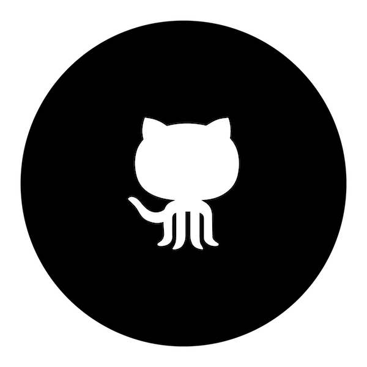

# MVC-repo

Introduktion
------------

Det här är en guide för hur du klonar repot och kommer igång med att använda min webbplats.

Klona repot
-----------

För att klona repot, gå in på "Tags" och tryck på "zip" på den senaste taggen.

Använd webbplatsen
------------------

För att använda webbplatsen, gå till mappen dbwebb-kurser/mvc/me/report i terminalen. Starta applikationen genom att skriva 'php -S localhost:8888 -t public'. Gå till localhost:8888 i webbläsaren. Här kan du navigera dig med hjälp av navbaren högst upp till höger. Du kan läsa om mig, om kursen och mina redovisningstexter. Om du trycker på "Lucky" så kommer ett heltal mellan 100 och 999999 att slumpas fram och presenteras i form av en färgkod.
